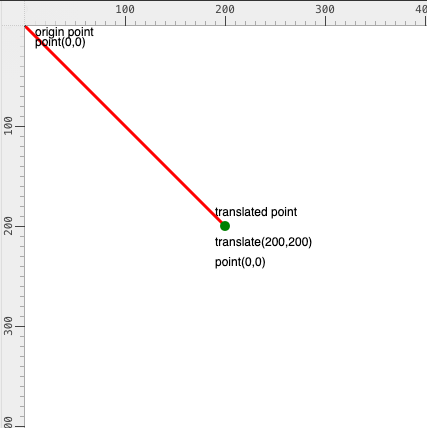
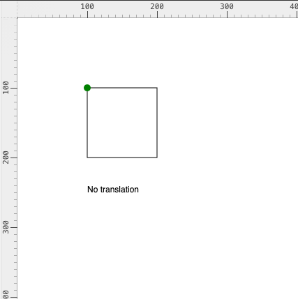
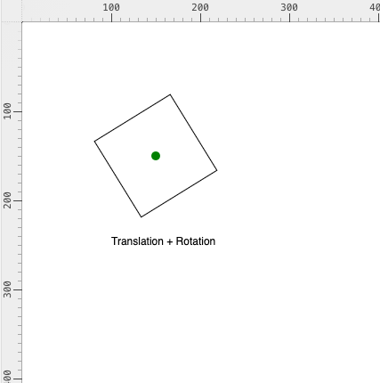

# Week 02: 9/4/26

## Agenda

1. Announcements
2. Technodiversity.org White Paper Reading Discussion
3. Assignment #1 review/livecoding
4. OpenProcessing editor essentials, 2D Primitives
5. Adding Color, `blendMode()`
6. Transformations: `translate()`, `rotate()`, `push()`, `pop()`
7. Pair up with a partner and exchange memory descriptions

## Announcements

- Everyone should have finished setting up accounts in [Required Tools](../README.md#required-tools) (OpenProcessing + GitHub).
- Assignment #1, *Locating Place|Space* Part 2 is due **9/11**.
- If I'm ever going too fast through any material, interrupt me!

## Assignment Review / Livecoding

We'll go over common questions from Assignment #1 Part 1 and livecode through a solution together.

## Reading Discussion: Technodiversity White Paper

Discuss the [Technodiversity.org White Paper](https://www.technodiversity.org/white-paper), assigned last week.

- What does "technodiversity" mean in contrast to a single dominant model of computation?
- Where do you see monocultures of tools, platforms, or assumptions in your own creative practice?
- How might technodiversity show up in how you draw, code, or document this semester?
- How can we improve AI without actually making it dangerous? What are the potential scope and constraints around AI?
- Rise of analog technology in response to digital technology?
- "Technology is inherently tied to cultural contexts from which it emerges. Technology is not culturally neutral, it adapts human biases into its design."
---

## OpenProcessing Editor Essentials

A quick recap of the editor from last week — Code tab vs. Play tab vs. Console (this is where your errors and `console.log()` output show up), saving with `⌘/Ctrl + S`, and sharing a sketch (see [Week 1's walkthrough](../class_01/readme.md#general-flow-how-to-submit-homework--share-work)).

## 2D Primitives

Everything we draw in p5.js starts from a small set of primitive shapes, plus color/style functions that affect whatever gets drawn *after* them.

```js
// point(x, y)
point(50, 50);

// line(x1, y1, x2, y2)
line(0, 0, 100, 100);

// rect(x, y, w, [h])
rect(100, 150, 100, 300);

// ellipse(x, y, w, [h])
ellipse(200, 200, 80, 80);

// triangle(x1, y1, x2, y2, x3, y3)
triangle(30, 75, 58, 20, 86, 75);

// arc(x, y, w, h, start, stop)
arc(150, 150, 80, 80, 0, PI);
```

Open a new sketch, `createCanvas(400, 400)` in `setup()`, and combine at least 3 primitives to sketch a simple scene or composition.

## Adding Color

In `p5.js`, color is handled similarly to most vector-graphic tools (ex. Adobe Illustrator). The two main shape attributes we modify are `fill()` and `stroke()`.

There are a few types of parameters `fill()` accepts (see the [full syntax](https://p5js.org/reference/p5/fill/)), but these three are the most common:

```js
// RGB (r = 255, g = 0, b = 0)
fill(255, 0, 0);
// RGBA
fill(0, 0, 255, 100);
// color string
fill("green");
```

A full list of named colors is available [here](https://developer.mozilla.org/en-US/docs/Web/CSS/Reference/Values/named-color). This same format works for `background()` and `stroke()` too.

We can also modify how colors layer on top of one another with [`blendMode()`](https://p5js.org/reference/p5/blendMode/). It only accepts specific values, which *must* be written in uppercase — see the [reference](https://p5js.org/reference/p5/blendMode/) for the full list.

`fill()`, `stroke()`, and `blendMode()` all impact *every shape that comes after them*. If you want different shapes to have different colors, add a new `fill()` before each one.

### Grouping with `push()` / `pop()`

We can force `fill()` (or any style/transform) to only apply to a specific shape by wrapping it in a layer:

1. `push()` marks where the group starts.
2. `pop()` marks where the group ends.

[`push()`](https://p5js.org/reference/p5/push/) and [`pop()`](https://p5js.org/reference/p5/pop/) always come in pairs — you can't have one without the other. This is useful for `fill()`, but becomes essential once we start transforming shapes.

## Transformations

There are three main transformation functions in `p5.js`:

- [`translate()`](https://p5js.org/reference/p5/translate/) — translates the coordinate system
- [`rotate()`](https://p5js.org/reference/p5/rotate/) — rotates the coordinate system
- [`scale()`](https://p5js.org/reference/p5/scale/) — scales the coordinate system



Like `fill()`, `translate()` impacts every shape that comes after it — so we always wrap it in `push()` / `pop()`. Otherwise, each translation adds onto the previous one instead of resetting.

`translate()` also lets us choose the anchor point a shape is rotated or scaled around:






```js
push();
translate(200, 200);
fill("green");
rotate(QUARTER_PI);
rect(-50, -50, 100, 100); // drawn relative to the translated origin
pop();
```

## Pair Activity: Exchange Memory Descriptions

This sets up Assignment #1 Part 2 (*Locating Place|Space*):

1. Individually, write a short description of a place that holds a memory for you — be specific and sensory.
2. Pair up with a partner (I'll assign pairs).
3. Exchange descriptions — just the text, no images or sketches.
4. On paper, sketch out your partner's description first. Make a few iterations — does it need to be literal, or can it include abstraction or your own embellishment?
5. Start translating your sketch into code using 2D primitives, `fill()`, `blendMode()`, and `translate()`, `rotate()`, `push()`, `pop()`.
6. Compare: how close did the drawing get to what your partner had in mind?

## Definitions: Glossary Additions

This week's definitions will be appended to the [glossary](../glossary.md):

| `p5.js` Glossary |                                                          |
| ---------------- | -------------------------------------------------------- |
| `point()`        | draws a single point at (x, y)                            |
| `line()`         | draws a line between two points                           |
| `rect()`         | draws a rectangle                                          |
| `ellipse()`      | draws an ellipse (a circle when w = h)                     |
| `triangle()`     | draws a triangle from three points                         |
| `arc()`          | draws an arc (a portion of an ellipse)                     |
| `fill()`         | sets the color used to fill shapes drawn after it          |
| `stroke()`       | sets the color used for shape outlines drawn after it      |
| `blendMode()`    | sets how newly drawn colors blend with what's beneath them |
| `push()`         | saves the current style/transform state, opening a group   |
| `pop()`          | restores the saved state, closing the group                |
| `translate()`    | moves the coordinate system's origin                        |
| `rotate()`       | rotates the coordinate system                               |
| `scale()`        | scales the coordinate system                                |

## References, Useful Links, and Demos

### References
- [p5.js Reference: Shape](https://p5js.org/reference/#Shape)
- [p5.js Reference: Color](https://p5js.org/reference/#Color)

### Extra Review Videos
- [RGB Color and blendMode()](https://www.youtube.com/watch?v=fTEvHLLwSBE&feature=youtu.be)
- [Translate(), Rotate(), Push(), Pop()](https://www.youtube.com/watch?v=maTfm84mLbo&feature=youtu.be)

### Demos

[will be populated after class]